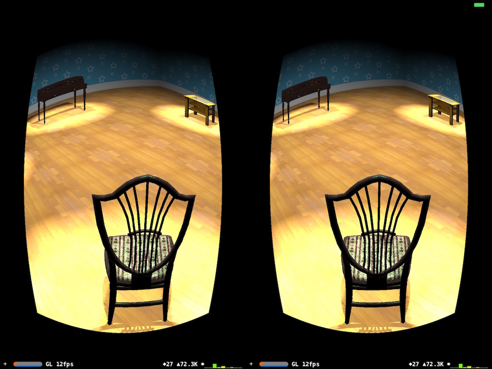

# SceneKit VR Sample

It's a 3D VR sample project using SceneKit. Panning with a finger tilts the camera, while with two fingers makes you move. 

**TODO List:**
- Accelerometer based control
- Enhancement of the quality of the barrel distortion shader
- Physics engine for collision detection

**[Mar. 1 2016]**
- Refactored, again
- Renamed the project

**[Feb. 29 2016]**
- Refactored
- Fix to avoid rendering bugs Metal makes, by forcing it to use GL
- Add shaders for VR rendering

**[Feb. 22 2016]** 
- The very basic Prototype -- working with only one scene

Thankfully I could stole the most of objects and textures in the project from <a href="https://developer.apple.com/library/ios/samplecode/SceneKitReel/Introduction/Intro.html">sample projects by Apple</a>, <a href="http://tf3dm.com/">tf3dm.com</a>, and <a href="http://sharecg.com">sharecg.com</a>. Please let me know if there are any license issues with 3d models used in this project.
